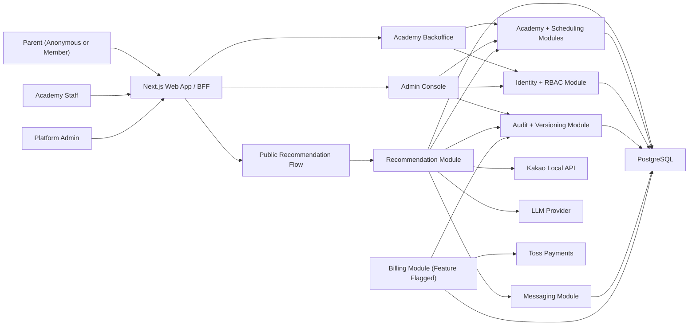

# Product Overview

## Purpose

Design a web platform that helps parents find suitable academies quickly while
giving academy staff and platform admins safe operational tools.

## Service Identity

- Parent-facing anonymous recommendation service
- Academy operations backoffice
- Platform review, audit, and rollback console

## Core Value

- Parent: choose a suitable academy with less uncertainty
- Academy: appear through accurate and reviewable information
- Operator: control data quality and recover safely from bad changes

## Finalized MVP Decisions

| Decision | Choice |
| --- | --- |
| Launch scope | One city first, expansion-ready schema |
| Data acquisition | Kakao Local seed + academy claim + admin review |
| Parent location input | Map pin + radius |
| Public result count | Top 3 only |
| Counseling channel | Platform messaging only |
| Parent identity | Anonymous recommendation, optional member signup |
| Minimum open threshold mismatch | `waitlist_only` result |
| Initial operator team | 3 operators |
| Year 1 scale target | 1,000 academies |

## Non-Goals

- No parent community or review ecosystem in MVP
- No academy ERP replacement for attendance, payroll, or grading
- No external crawling-based reputation system in MVP

## Success Metrics

- Parent receives useful results within 3 minutes
- Top 3 results are explainable and schedule-aware
- Academy data changes are reviewable and reversible
- Billing can be added later with minimal domain churn

## System Context

## Architecture Principle

The system is not a pure AI app. It is a deterministic matching product with an
AI interpretation and explanation layer.
