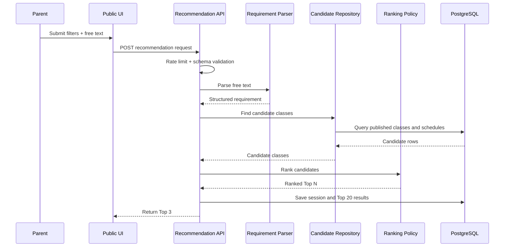

# User Flows

## Parent Flow

1. Parent opens the public recommendation page.
2. Parent selects region, student grade band, subject, budget, commute range,
   time preferences, and teaching style.
3. Parent may add one free-text request.
4. System validates the payload and creates an anonymous session.
5. LLM parses the free text into structured requirement JSON.
6. Backend applies deterministic filters and ranking.
7. System returns Top 3 results with reasons and warnings.
8. Parent may compare results or sign up to start platform messaging.

## Academy Flow

1. Staff logs in.
2. Staff claims or selects the organization and branch.
3. Staff edits branch profile, programs, class groups, schedules, and seat data.
4. Each write creates an audit event and a new version snapshot.
5. High-risk changes move to review when required.
6. Published data becomes eligible for recommendation.

## Admin Flow

1. Admin reviews pending changes and claim requests.
2. Admin approves, rejects, suspends, or requests fixes.
3. Admin compares versions and triggers rollback by creating a new version from
   a past snapshot.
4. Admin reviews audit logs, anomalies, and operational metrics.

## Recommendation Sequence

## Edge Cases

- If the input is incomplete, ask at most one follow-up question.
- If data is stale, keep the result but show a warning badge.
- If a class is full or below minimum open threshold, expose it as
  `waitlist_only`.
- If sponsored placement is added later, it must be labeled explicitly.
