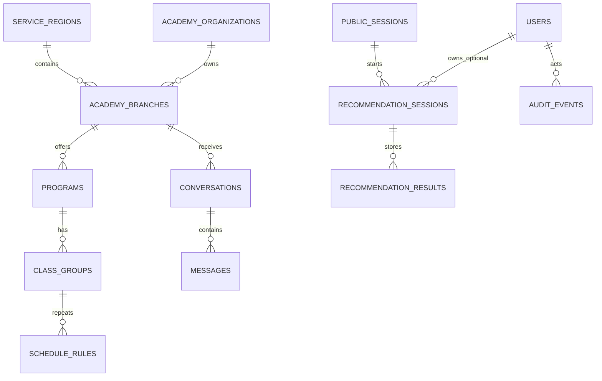

# Domain Model

## Glossary

- Organization: legal or business entity operating academies
- Branch: physical location exposed to parents
- Program: subject and grade-band offering at a branch
- Class Group: enrollable learning group under a program
- Schedule Rule: repeating weekly schedule definition for a class group
- Recommendation Session: one parent search execution
- Recommendation Result: ranked output stored for analytics and re-entry
- Audit Event: immutable record of an action
- Version Snapshot: immutable copy of an aggregate state

## Aggregate Boundaries

- `academy_organization`
- `academy_branch`
- `program`
- `class_group`
- `schedule_rule`
- `recommendation_session`
- `conversation`

## Source Data vs Derived Data

### Source Data

- `max_capacity`
- `min_open_threshold`
- `reported_enrolled_count`
- `monthly_fee_krw`
- `latitude`, `longitude`
- `supports_shuttle`
- `review_status`
- `verified_at`

### Derived Data

- `available_count`
- `distance_km`
- `selected_distance_km`
- `freshness_score`
- `recommendation_score`
- `result_status`

## Event Storming Starter Events

- Academy registered
- Branch claimed
- Branch profile updated
- Program created
- Class group created
- Schedule rule changed
- Capacity changed
- Branch published
- Recommendation session created
- Recommendation results stored
- Conversation opened
- Message sent
- Version restored

## Model Diagram

## Core Business Rules

- Route handlers do not write to the database directly.
- Every write use case emits an audit event.
- Every write on a versioned aggregate stores a new immutable snapshot.
- Rollback never mutates a historical version in place.
- Recommendation ranking is deterministic after requirement parsing.
